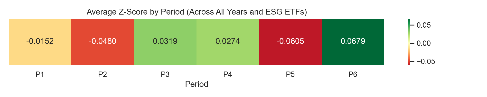

# Behaviour During the Year: Finding Seasonality in ESG and Non-ESG ETFs

Does an energy ETF perform better in winter? Does a travel and leisure ETF shine in summer? To answer questions like these, we’ll explore whether seasonality affects ETF performance—and whether those patterns repeat year after year. The goal is to move from what to invest in, to when to invest in what.

## A First Look

To get a high-altitude, eagle-eye view of ETF behaviour over time, we started by building a heatmap that shows the average price of each ETF for every month across all available years
.
<iframe src="https://pablovallbona.github.io/ada-template-website/assets/graphs/monthly_heatmap.html" width="100%" height="600px" style="border:none;"></iframe>

At first glance, this broad overview doesn’t give us much to work with no obvious seasonal pattern jumps off the screen. So, we decided to break the year into smaller segments to see whether seasonality becomes more visible when time is grouped more coarsely than by month.

<iframe src="https://pablovallbona.github.io/ada-template-website/assets/graphs/heatmap-split6.html" width="100%" height="600px" style="border:none;"></iframe>

Wow... still no dramatic revelation. If we squint (and maybe tilt our head a little), we might convince ourselves that performance is slightly higher in the second and sixth segments of the year. But making investment claims based on colour gradients and imagination wouldn't be very "data-scientist" of us. So instead, we’ll do this properly by running a t-test to check whether the average returns in these periods truly differ in a statistically significant way, rather than just appearing so visually.

## A Deeper Look

Ok, let's put our scientist lab coats on, (even if data scientists don't have lab coats). We will keep on looking at the whole ETF market for the time being. 

Here, we see the average z-scores for each period of the year. It turns out we were wrong about the second period which is actually below the overall average. On the other hand, the last period, representing November and December, shows stronger performance, likely reflecting the impact of Black Friday and the Christmas shopping season. We also observe higher performance during the third and fourth periods, corresponding to the summer months from May to August. This is a bit surprising, as it seems to contradict the _“Sell in May and go away”_ adage, where stocks are typically sold off during the summer, causing market performance to dip. However, ETFs in the travel, leisure, and energy sectors, boosted by summer vacations and gasoline demand, could explain this upward trend. That said, to make any confident claims, we need to check the statistical significance of these results. The patterns are interesting, but only a proper significance test can tell us whether they are meaningful or just random noise.

Below is a table of the results of our t-test:

| Period | Mean Z-Score | t-statistic | p-value | N, (Sample Size) |
|:------:|:-------------:|:------------:|:----------:|:------:|
| 1 | -0.003281 | -3.867973 | 1.097500e-04 | 1135853 |
| 2 | -0.017975 | -14.779352 | 2.010416e-49 | 1222789 |
| 3 | 0.012909 | 15.625344 | 4.952618e-55 | 1234268 |
| 4 | 0.011028 | 14.719023 | 4.911571e-49 | 1281210 |
| 5 | -0.031869 | -38.311373 | 0.000000e+00 | 1325740 |
| 6 | 0.031200 | 36.317516 | 1.225119e-288 | 1214537 |

Firstly, the large sample size strengthens our observations, which is further supported by the very small p-values, lettting us reject the null hypothesis that there is no correlation between the time of the year and the performance of the ETF market. We do have to note how small the z-scores are showing that this variation in between seasons is not very large. 

## Looking at the ESGs

Now lets do a similar analysis for our ESG ETFs. 

The results are broadly similar, but we observe an increase in the absolute values of the z-scores across all periods. This suggests a seasonality pattern that is comparable to the one observed for all ETFs, but potentially slightly stronger in magnitude. To see whether these differences are meaningful, we now turn to the t-test results to assess statistical significance.

| Period | Mean Z-Score | t-statistic | p-value | N |
|:------:|:------------:|:-----------:|:--------:|:---:|
| 1 | -0.015203 | -2.139908 | 3.237800e-02 | 15,286 |
| 2 | -0.047980 | -4.230572 | 2.343786e-05 | 16,211 |
| 3 | 0.031941  | 4.344045  | 1.407367e-05 | 16,144 |
| 4 | 0.027376  | 4.423547  | 9.769529e-06 | 17,030 |
| 5 | -0.060516 | -8.977443 | 3.046224e-19 | 17,541 |
| 6 | 0.067915  | 9.478198  | 2.940545e-21 | 16,047 |

In this case, the p-values are still low, though generally higher than in the full ETF analysis, and remain statistically significant for all periods when using a 0.05 significance threshold.

## In Conlusion:

What we can first conclude is that this seasonality analysis turned out to be… slightly underwhelming. The ESG and non-ESG ETFs display very similar seasonal patterns, and while we do find statistically significant differences across periods, the associated z-scores are extremely small. This indicates that, despite statistical significance, the economic impact of these seasonal effects is minimal and likely negligible in practice.
It’s a bit disappointing—we had high hopes for uncovering strong seasonal signals here, but that’s part of the data analysis journey. Not every path leads to a breakthrough. Still, ruling out weak or insignificant effects is valuable in itself, and we move forward a little wiser than before.