# Volatility and Yield Analysis
* * *
This is the part where data is going to tell us whether, in the past years, investing in ethical ETFs could also lead to good financial results.

Before anything else, we first need to understand what kind of data we are working with and what its limitations are.

In this dataset, there are **61 different ETFs with an ESG label**. Each one has a different timeframe depending on how long data has been available (see the *Data* section for more details about each ETF).

We now face a major issue:  
to maximize the quality of our answer, we would like our analysis to include **as many ESG ETFs as possible** *and* to be performed over the **longest possible timeframe**.  
However, the longer the timeframe, the fewer ESG ETFs actually have data available over that window.

The following graph — the famous *“survivor function”* — shows how many ESG ETFs remain in the analysis depending on the length of the chosen timeframe.

---

  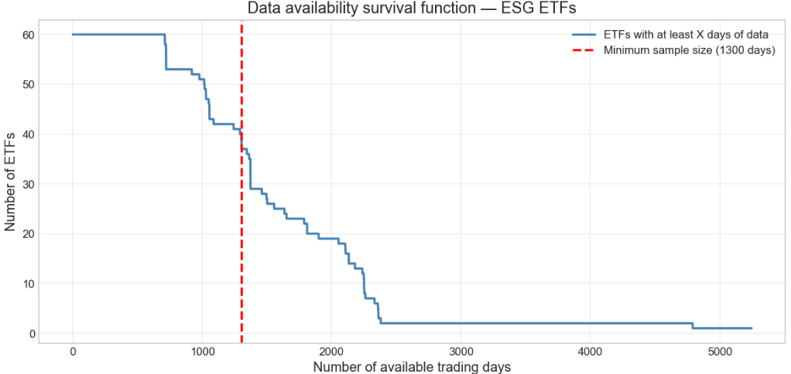

  

---

We can clearly see on this graph that there is a massive trade-off between the timeframe length and the number of ESG ETFs remaining in the dataset. Even for the smartest analyst bros and sisters, it is hard to justify the “perfect” number of days to choose for an optimal analysis.

The methodology we applied is the following:

Part 1. We first perform the comparison on one “middle-ground” point  
   → **1300 days**, leaving **41 ESG ETFs** in the analysis.  
   This example helps us show how the ESG ETFs are compared to the market as a whole.

Part 2. Then we repeat the exact same analysis across many different thresholds  
    to check whether there is a common tendency toward higher or lower performance in terms of yields and volatility.

This way, instead of relying on a single arbitrary timeframe, we examine whether the results are **stable across multiple horizons**, making our conclusions far more robust.
---
### Part 1. Performance of ESG ETF vs the market on a middle-ground point:

Lets Dive now in the first poart of our analysis. We selected the middle-ground point in our analysis. For each ETF that has data available in this time frame we perform the folowing calculations :

---
- The log daily return :
  
$$
r_t = \ln\left(\frac{P_t}{P_{t-1}}\right)
$$

---
- The We then compute the **average daily log return** for each ETF:
  
$$
\bar{r} = \frac{1}{N} \sum_{t=1}^{N} r_t
$$

---
Once we know the average daily log return of an ETF, we turn it into an average yearly performance over this Timeframe :

$$
\text{Annualized Return} = e^{252 \cdot \bar{r}} - 1
$$

Log returns and annualized returns are commonly used in finance because they behave much better than simple returns. 
They naturally account for the negative impact of volatility on long-term growth (“volatility drag”) and combine additively over time, making them ideal for multi-period analysis.<a href="conclusion.html#ref-4" id="cite-esg-4">[4]</a>
For a rigorous explanation of why log returns are preferred in financial modeling, see:  
Hull, *Options, Futures, and Other Derivatives*, Chapter 15 (standard reference in quantitative finance).<a href="conclusion.html#ref-5" id="cite-esg-5">[5]</a>.
If you prefer, I can also link a free online source (MIT, CFA, or an academic paper).<a href="conclusion.html#ref-6" id="cite-esg-6">[6]</a><a href="conclusion.html#ref-7" id="cite-esg-7">[7]</a>

---

-The volatility of each ETF:

$$
\sigma = \sqrt{\frac{1}{N - 1} \sum_{t = 1}^{N} (r_t - \bar{r})^2}
$$

Volatility measures how much an ETF's returns fluctuate around their average value.  
Mathematically, it is the standard deviation of daily log returns. A higher volatility means the ETF experiences larger day-to-day movements, which corresponds to higher uncertainty and higher risk of rapid losses.<a href="conclusion.html#ref-8" id="cite-esg-8">[8]</a>.

---

Let's now plot the results correspondingg to this Timeframe : 

**Figure 1 — Annualized Return and Volatility**

---
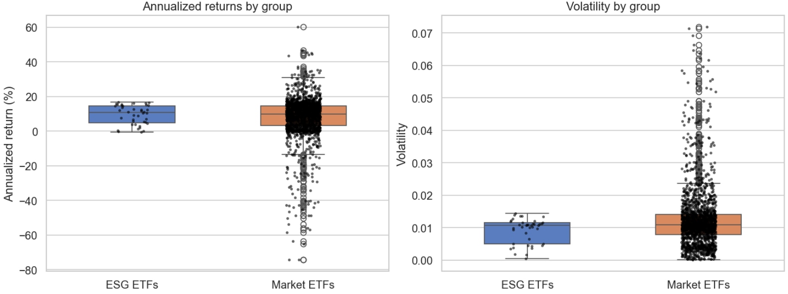

---

And let s compute aswell :

---
- The average anualized return of each Group :
  
$$
\overline{R}_{\mathrm{ann}} 
= \frac{1}{K} \sum_{i=1}^{K} R_{\mathrm{ann},i}
$$

- The average volatility of each group :

$$
\overline{\sigma} 
= \frac{1}{K} \sum_{i=1}^{K} \sigma_i
$$

These formulas make sense because our goal is to compare the **typical performance of an ESG ETF** with the **typical performance of an ETF in general**.  
In other words, we want to know: *“If I pick one ETF at random from each group, which group performs better on average?”*

---

To answer this, we simply compute the **average annualized return** and **average volatility** across all ETFs in each group:

- the mean annualized return  
- the mean volatility  

This reflects the performance of an “average ETF” in the group, not the performance of a hypothetical portfolio that invests equally in every ETF.
If we wanted to evaluate such a portfolio, we would need a different mathematical approach (averaging log returns, compounding the combined series, etc.).  
But since our objective is to compare **individual ETF performance**, the simple group mean is better suited.

---

**Table 1 — ESG vs Market Performance Summary**

| Group        | Avg Annualized Return (%) | Avg Daily Volatility | Excess anualized return vs Market (%) |
|--------------|----------------------------|------------------------|------------------------|
| **ESG ETFs**    | 9.45                       | 0.0091                 | 1.14                   |
| **Market ETFs** | 8.31                       | 0.0124                 | 0.00                   |

---

This seems promising for all the Sisters and Bros ethic lovers !

From the results shown in [Figure 1](#fig-vol-yield-no-outliers) and [Table 1](#table-esg-performance), ESG ETFs appear to outperform the overall market.  
They are **less volatile** (and therefore less risky) while also delivering an **average excess annualized return of +1.15%**.  
In practical terms: picking a random ESG ETF would, on average, yield **1.15% more per year** than picking a random ETF from the broader market over this timeframe.

---
But let’s not jump to conclusions too quickly!

In the version *with* outliers shown in [Figure 2](#fig-vol-yield-with-outliers), the number of analyzed ETFs is **much larger** on the market side than on the ESG side.  
As a result, the market group exhibits a **much wider spread** in both volatility and returns.  
At first glance, this might suggest that ESG ETFs are inherently more stable.  
However, our analyst sisters warned us: this effect may simply be the result of **sample size differences**.

---

Because the ESG dataset is much smaller, it is statistically easier for it to **avoid extreme values purely by chance**.  
Before claiming that ESG ETFs are structurally more stable, we first remove outliers from the market ETF group in terms of volatility and return.  
We then repeat the same analysis to compare ESG ETFs against a “normal”, non-outlier ETF in the broader market.

To do this, we filter out all market ETFs whose returns or volatilities lie more than **2 standard deviations** away from the mean.  
This corresponds approximately to keeping the central 95% of the data, which is a common threshold in statistical analysis.

---

Lets Now perform the same analysis related results:

**Figure 2 — Annualized Return and Volatility (without outliers)**

---
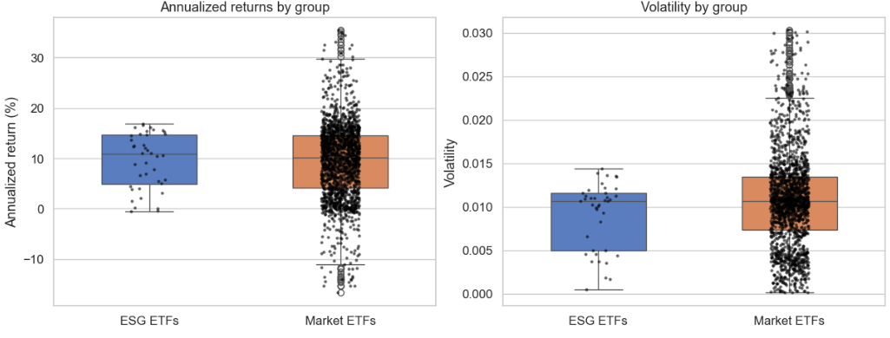
     
---

**Table 2 — ESG vs Market Performance Summary (after removing outliers)**

---

| Group        | Avg Annualized Return (%) | Avg Daily Volatility | Excess Annualized Return vs Market (%) |
|--------------|----------------------------|------------------------|------------------------------------------|
| **ESG ETFs**    | 9.450798                   | 0.009085               | -0.045235                                 |
| **Market ETFs** | 9.496033                   | 0.010751               | 0.000000                                  |

**Sad news...** even though the risk still seems much lower as the average volatility of an ESG ETF is still much lower than the average of the market, they now seem to have slightly lower performances on the anualized return with a negative performance of **-0.45%** against a usual ETF in the market. 

**But BRO BRO BRO don't cry right now !** Remember this is just one point of analysis among many different time frames ! Read the next part before jumping once again to fast conclusions !

***

### Part 2. Performance of ESG ETFs vs. the Market Across Different Timeframes

Now that we’ve seen how to compare ESG ETFs with the overall market on a **single** timeframe, the next step is to examine how this comparison behaves across **many different time ranges**.  
This allows us to detect **general performance trends** rather than relying on one arbitrary choice — giving us a far **more robust** answer about ESG ETF performance.

---

### A New Dilemma: What Should We Do With Outliers?

In Part 1, we removed outliers from the broader ETF market before comparing it to ESG ETFs.  
But when extending the analysis across many timeframes, a legitimate question arises:

#### **Option 1 — Keep the outliers**  
This assumes that investing in ETFs is a bit like gambling:  
big wins and big losses *do* happen, and therefore extreme values should **not** be removed.

 *Interpretation:* Outliers are part of real financial behavior.

#### **Option 2 — Remove the outliers**  
This assumes that the small number of outliers among ESG ETFs may simply be due to **luck and small sample size**.  
To ensure a fair comparison, we might want to clean both datasets consistently.

 *Interpretation:* Removing outliers gives a more typical picture of what an investor can expect.

---
Our smartest bros and sisters came up with the same wisdom as before:  
> **“If you don’t know which option to choose… just choose all of them!”**

So, we will compute ESG vs Market performance across many different timeframes,  
**both with and without removing outliers**, and compare the results side by side.

---

Let’s get to the fun part!

Before running the analysis, we first define the different **timeframes** we want to evaluate.

We choose:
- a **minimum timeframe of 600 days**, where **60 ESG ETFs** still have available data,  
- a **maximum timeframe of 2200 days**, where **13 ESG ETFs** remain.

Between these two extremes, we run the same Part 1 analysis at **every 100-day step** (500, 600, 700, …, 2200 days).
We then extracted and ploted the results from "average volatility" and "Anualized return of ESG vs Market" of each ETF group and plot.

Let's see what we got!

---

## Results 

### with outliers kept in the Market data:

---
- Volatility comprison :
 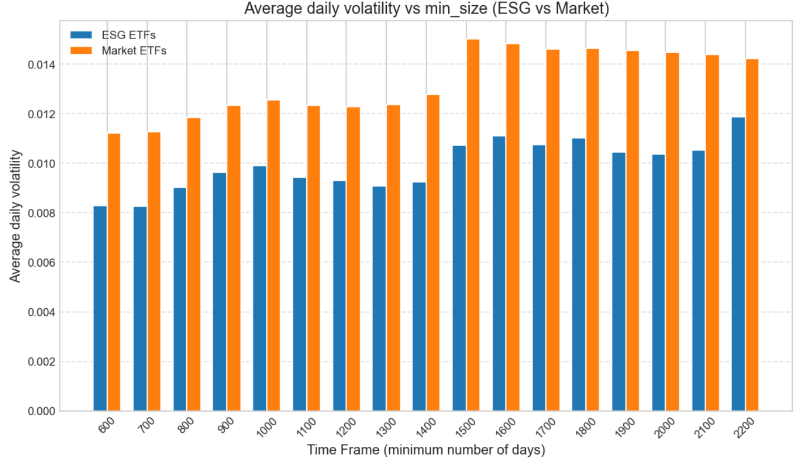
Across all evaluated timeframes, the **average volatility of ESG ETFs is consistently lower** than that of the overall market.  
In every single case, the gap remains **significant (around 0.02 of volatility units or more)**.  

**Conclusion:** When outliers are included, ESG ETFs appear **systematically more stable** and exhibit **lower daily risk** regardless of the chosen timeframe.

---

- Anualized return comparison :
  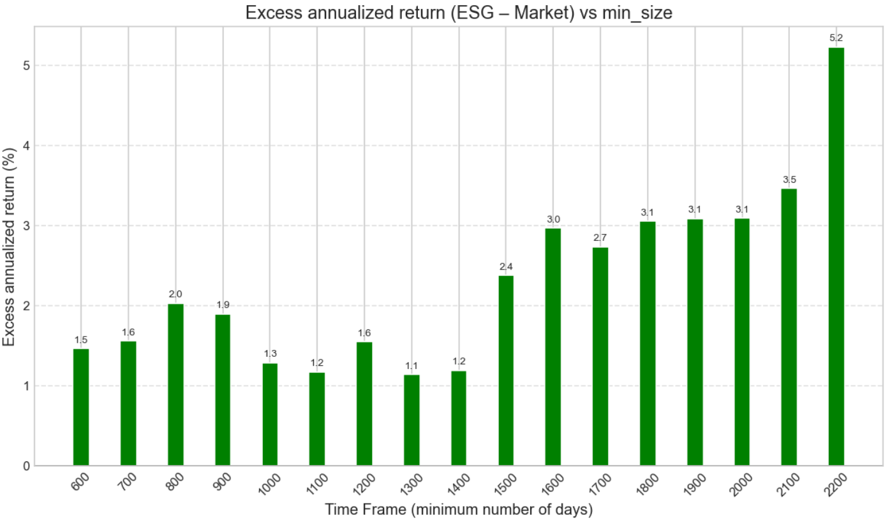
Here again, the dominance of the ESG group is very clear.  
For every timeframe tested, ESG ETFs show a **positive excess annualized return**, typically between **+1.1% and +2%**, and sometimes even **above +3%**.

 **Conclusion:** With outliers kept, ESG ETFs tend to **strongly outperform** the general ETF market in terms of long-term returns.

---

### without outliers in the Market data:

---
- Volatility comprison :
 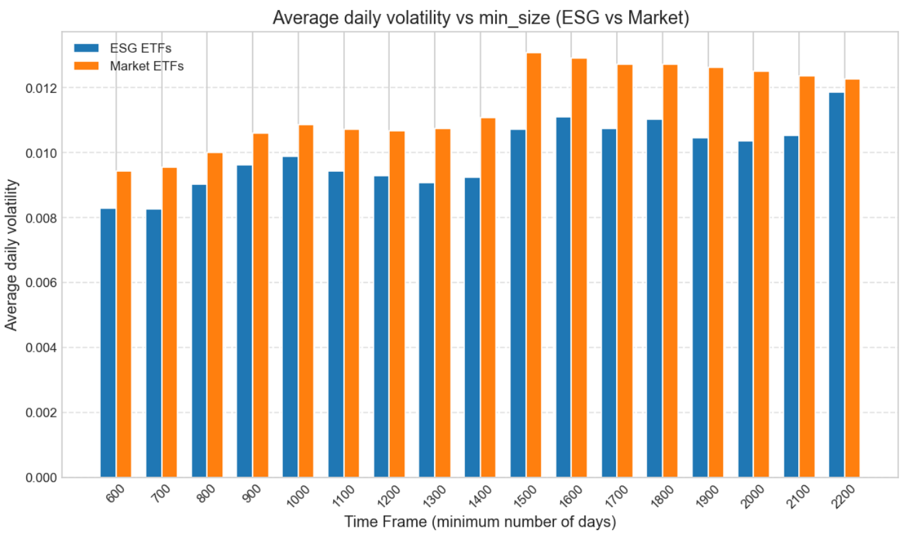
     
Even after removing extreme values from the market data, ESG ETFs remain **systematically less volatile** across all timeframes.  
The magnitude of the difference becomes slightly smaller, but the hierarchy does **not change**.

**Conclusion:** ESG ETFs still appear **less risky** on average than non-ESG ETFs, even once the comparison is made fairer by removing outliers.

---
- Anualized return comparison :
  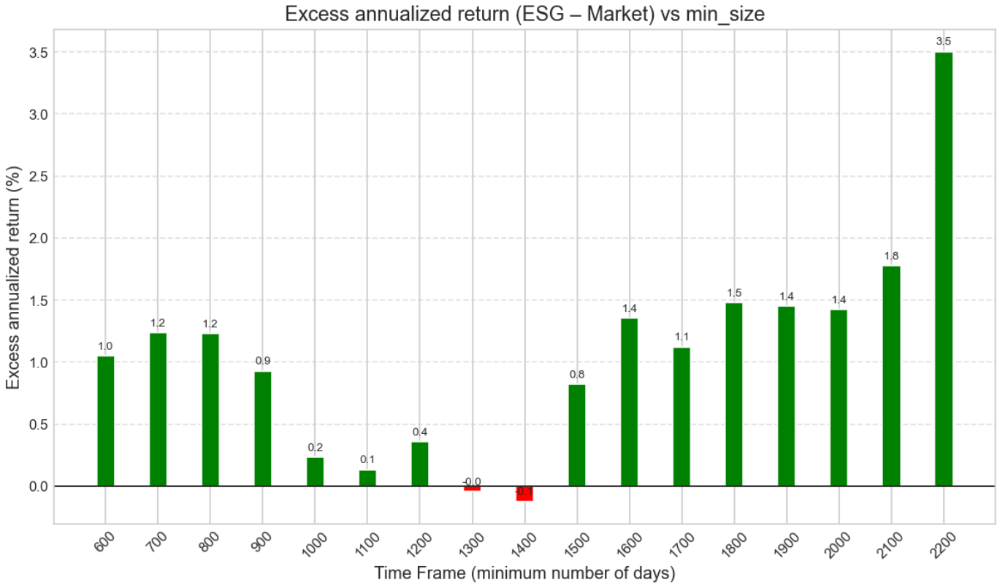
 
Once outliers are removed, the picture becomes more nuanced.  
For smaller timeframes, ESG ETFs tend to outperform the market by **1% to 2%** per year.  
However, around the **1300–1500 day** region, the excess return drops close to **0%** or slightly negative.  
For longer timeframes, the advantage becomes positive again and continues increasing.

**Conclusion:**  
Removing outliers shows that ESG ETFs **do not always outperform** the market in every timeframe,  
but the **general tendency remains favorable**, especially for medium and long horizons.

---

###  Final Interpretation

- **Volatility:** ESG ETFs are consistently *less volatile* than the market, with or without outliers.  
- **Returns:**  
  - With outliers → ESG **strongly outperforms**.  
  - Without outliers → performance becomes more mixed, but the trend is still **positive overall**.

 **Overall, ESG ETFs seem to offer a better risk–return profile**.

 ***

 ## High risk = High reward?

---

This part is for all the bros and sisters that are willing to get high returns with ESG ETFS.
Using the previously computed values on volatility and yield this part will answer the wether taking higher amount of risk, therfore investing ine ESG ETF with higher volatility (more volatility = more uncertainty), also tend to increase the average return related to the ESG in the past few years.

Let's answer this question with the same metodology we used above: 
First we will check the correlation between the volatility on our initial example with the Timeframe of 1300 days and 41 ESG ETF left.
We will calculate the pearson correlation between volatility and return o this first example.
Then once again to analyse it on all the different chosen timeframes.

*reminder: the times frames are every 100-day step (600, 700, …, 2200 days)*

---

### Pearson Correlation and Statistical Significance

The Pearson correlation coefficient between ESG ETF volatility and annualized return is computed as:

$$
r = \frac{\sum_{i=1}^{n} (x_i - \bar{x})(y_i - \bar{y})}
{\sqrt{\sum_{i=1}^{n} (x_i - \bar{x})^2} \sqrt{\sum_{i=1}^{n} (y_i - \bar{y})^2}}
$$

where:
- $x_i$ denotes ESG ETF volatility,
- $y_i$ denotes annualized total return,
- $\bar{x}$ and $\bar{y}$ are the sample means,
- $n$ is the number of ETFs in the sample.

To assess statistical significance, the corresponding t-statistic is computed as:

$$
t = r \sqrt{\frac{n - 2}{1 - r^2}}
$$
  
The p-value is then obtained as:

$$
p = 2 \cdot \left(1 - F_t(|t|, n - 2)\right)
$$

A correlation is considered statistically significant if the p-value is below the chosen significance threshold.  
In this study, standard thresholds are used: p < 0.05 indicates statistical significance, while p < 0.01 indicates strong statistical significance.

Since all the necessary values where already calculated [above](#clalculus-of-yields-and-volatility), we can directly plot our results:

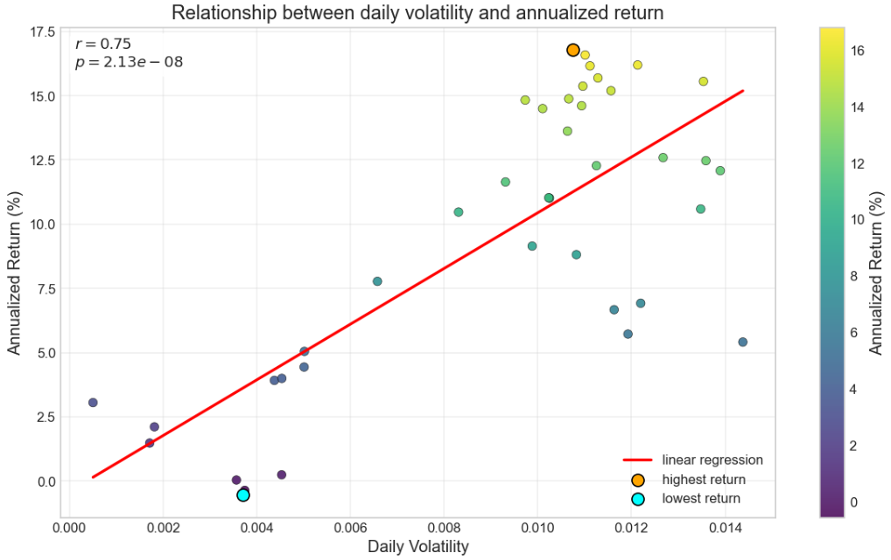

In this specific case, the Pearson correlation coefficient is high ($r = 0.75$) and the associated p-value ($p = 2.13 \times 10^{-8}$) indicates statistical significance. This suggests that, over this time frame, higher volatility is associated with higher returns; however, this observation is specific to the period analyzed, and we next examine whether similar patterns hold across other time frames.

---

Now we can plot the differrents p values and pearson correlation coefficients for every different choses times frames :

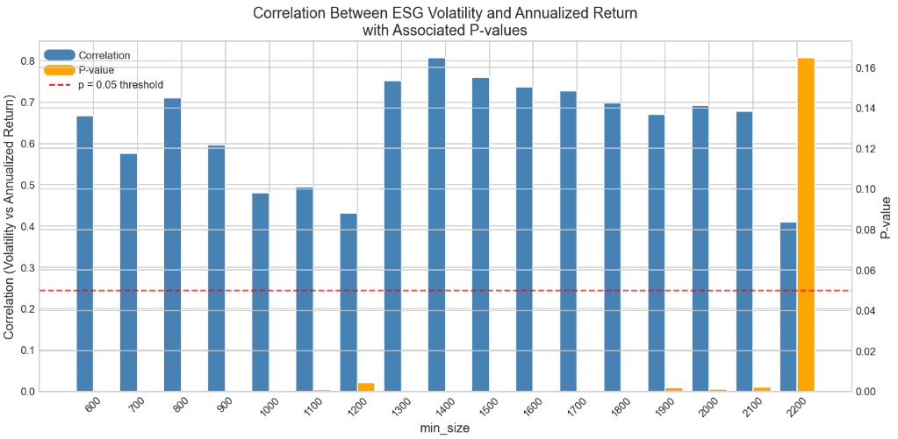

Across most time frames, the correlation between ESG ETF volatility and annualized returns is consistently positive and statistically significant, with Pearson correlation coefficients generally ranging between 0.6 and 0.8 and p-values below the 5% significance threshold. This indicates a robust statistical association within the analyzed sample. However, the strength of the relationship varies across time windows and weakens for the longest horizons, where the number of available ETFs is smaller. These results therefore highlight a stable positive correlation between vollatility and return over the different ESG ETF.

A geometry expert Sister suddently shouts in the back of the room: 
> **“WAIIIIIIT I'HAVE SEEN THIS SHAPE BEFORE!!”** 

### Correlation vs. Average Performance: Is There a Hidden Pattern?

Our geometry expert was onto something.

Up to now, we looked at two things **separately**:
- how strong the correlation between volatility and return is, and  
- how high the average annualized returns are.

But what if these two were actually *moving together*?

To check this, we plot for each timeframe:
- the **correlation between ESG ETF volatility and returns**, and  
- the **average annualized return of ESG ETFs** over the same period.

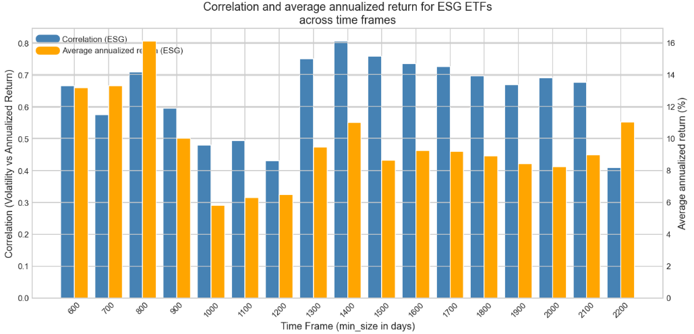

Visually, the shapes are not random at all: when the **average return is higher**, the **volatility–return correlation also tends to be higher**, and when the average return drops, the correlation weakens.

To quantify this, we take one step further, computing a Pearson correlation within a Pearson correlation, or, borrowing from Inception, a small **“Pearsonception.”**
- $X =$ “correlation (volatility vs return) for ESG ETFs”, and  
- $Y =$ “average annualized return of ESG ETFs” across timeframes.

For ESG ETFs only, we obtain:

- $r \approx 0.43$  
- $p \approx 0.10$  

So the association is **moderately positive**, but **not statistically significant** at the usual 5% threshold. In other words, there is a visible tendency for “better ESG periods” to come with a stronger volatility–return link, but the data are not strong enough to make a hard claim. It’s more of a *hint* than a formal proof.

---

### What Happens If We Forget ESG Labels and Look at All ETFs?

Now comes the fun comparison.

We repeat exactly the same exercise, but this time on the **entire ETF universe** (with outliers kept), and plot:

- the correlation between volatility and returns for all ETFs, and  
- their average annualized return over each timeframe.

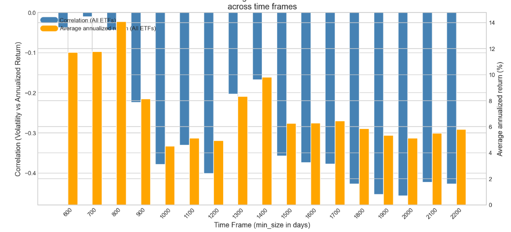

Here, the pattern becomes much more striking. When the **overall ETF market performs strongly**, the volatility–return correlation becomes much stronger; when performance is weaker, the correlation collapses.

Running the same meta-correlation between:

- $X =$ “correlation (volatility vs return) for all ETFs (with outliers)”, and  
- $Y =$ “average annualized return of all ETFs”,

we get:

- $r \approx 0.88$  
- $p \approx 1.35 \times 10^{-5}$  

This is a **very strong and statistically significant** relationship. In plain language:

> In the full ETF universe, the periods with the highest average returns
> are exactly those where volatility and returns are most strongly linked.

---

### So… Is “High Risk = High Reward” or Just “High Trend = High Correlation”?

Putting all this together, we can now refine our earlier interpretation:

- Yes, for ESG ETFs, we do observe a **positive correlation** between volatility and returns across many timeframes.
- But this correlation **seems to strengthen when the whole environment is good** (high average ESG returns) and would likely be weaker in less favorable regimes.
- On the broader ETF universe, this effect is even more obvious: when the market is doing great, volatility behaves more like an **upside amplifier** than a neutral risk measure.

In other words, the volatility–return correlation we see for ESG ETFs is **not a timeless law of finance**.  
It is at least partly **biased by the fact that ESG ETFs performed very well over the sample period**. During strong performance regimes, high-volatility products tend to sit on the right side of the trend and look like “high risk = high reward”. But if the global ESG performance were to weaken, the same high volatility could just as easily amplify **losses** instead.

So from an investor perspective:

> Higher volatility in ESG ETFs has historically been associated with higher returns in this dataset, **but mainly in periods when ESG as a whole was doing well**. Volatility is better seen as an amplifier of whatever regime you are in, not as a guarantee of extra return.

Time to keep that in mind before aping into the spiciest ESG tickers on the list.

